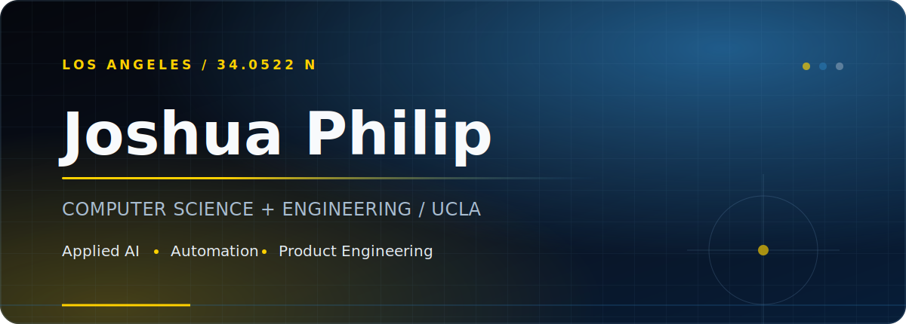
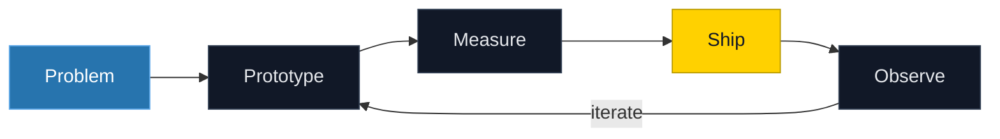

<div align="center">



<br />

<a href="https://www.linkedin.com/in/joshua-philip123/">LinkedIn</a>
&nbsp;&nbsp;/&nbsp;&nbsp;
<a href="mailto:joshuaphilip2140@gmail.com">Email</a>
&nbsp;&nbsp;/&nbsp;&nbsp;
<a href="https://github.com/JoshuaA1292?tab=repositories">Repositories</a>

</div>

## Work

I build software around applied AI, automation, and web systems. I care about the less visible parts of a product: reliable pipelines, clean interfaces, useful evaluation, and getting a prototype into production.

```text
FOCUS       AI systems · workflow automation · product engineering
CURRENT     Computer Science & Engineering at UCLA
BASED       Los Angeles, California
```

## Toolkit

| Area | Technologies |
|:--|:--|
| **Languages** | Python, TypeScript, JavaScript, SQL, Bash |
| **Application** | React, Next.js, FastAPI, Tailwind CSS |
| **Data & infra** | PostgreSQL, Docker, Linux, GitHub Actions, Vercel |
| **AI** | OpenAI, Anthropic, Gemini, retrieval, agents, evaluation |

## How I Build



<details>
<summary><strong>What I optimize for</strong></summary>
<br />

- Small, testable releases instead of oversized rewrites
- Automation where it removes repetition, not where it hides decisions
- Observable systems with explicit failure modes
- Interfaces that make complex systems feel simple

</details>

---

<div align="center">
<sub>UCLA · Computer Science & Engineering · Los Angeles</sub>
</div>
